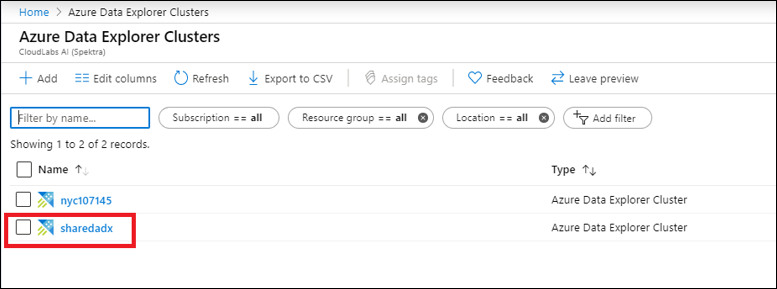
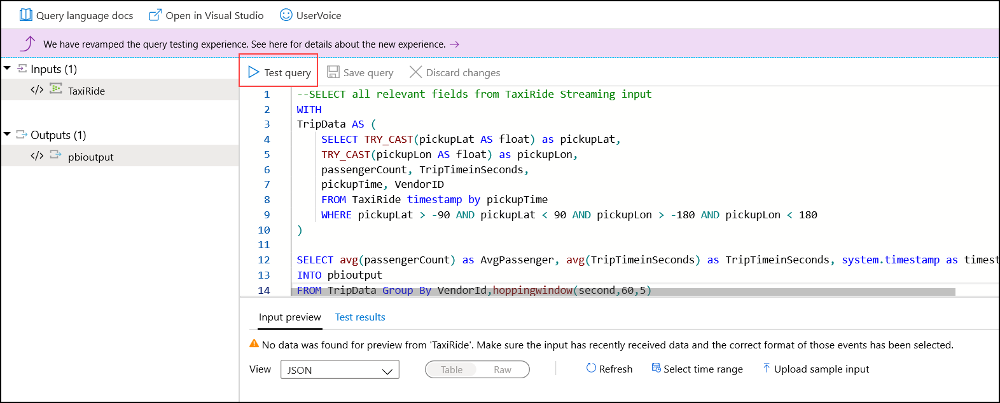
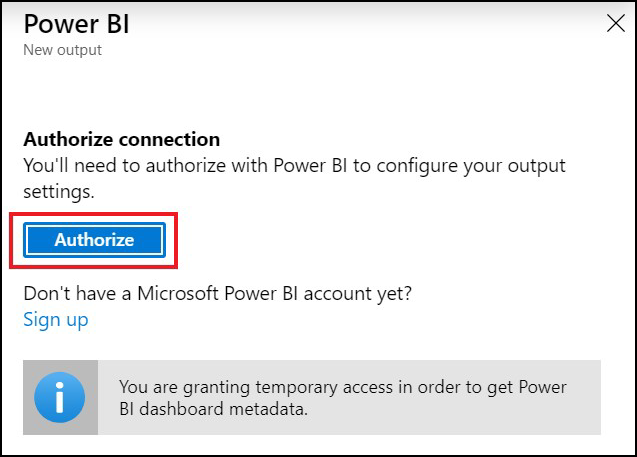
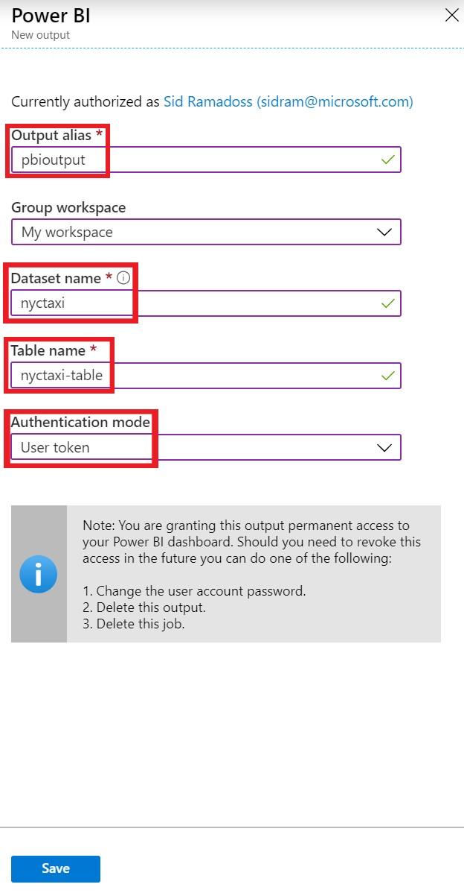
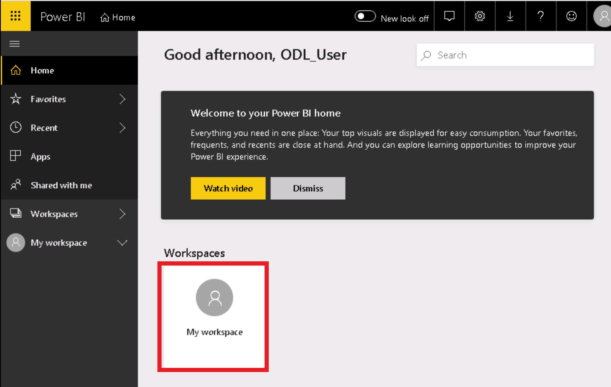
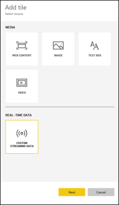
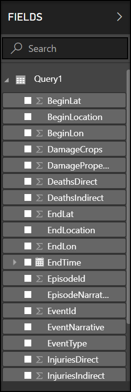
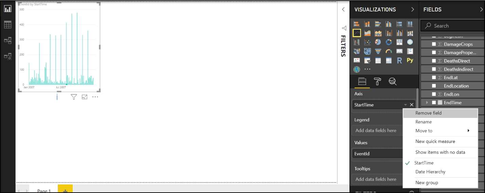
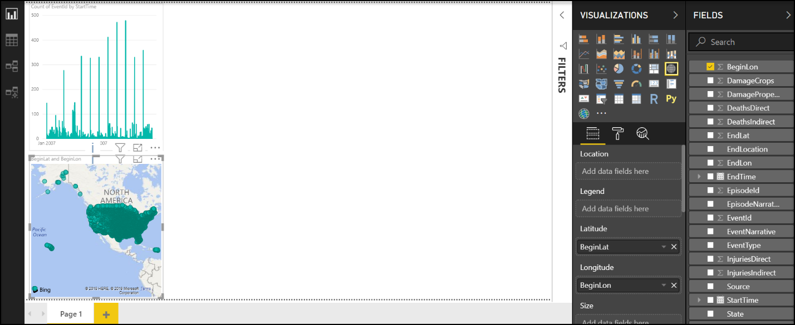
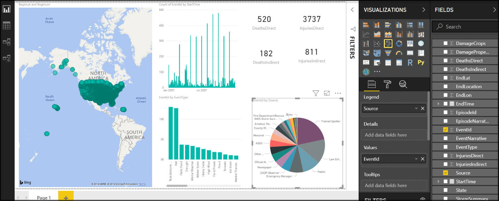

# Build solutions powered by real time analytics using Azure Stream Analytics and Azure Data Explorer 

Are you looking to help your customers make business decisions with immediate impact based on real-time terabytes or petabytes of data in seconds? In this session, you will build a near-real-time analytical solution with Azure Data Explorer (ADX) and Azure Stream Analytics. ADX enables you to do interactive ad-hoc queries of large amounts of data and Stream Analytics helps you analyze and process real-time data that can be used to trigger alerts and actions.
 
 **Contents**
 
   - Infrastructure
   - Pre-Exploration
   - Stream Analytics
   - Post-Exploration
   - Self-Study 
     - Azure Stream Analytics (ASA)
     - Kusto Query Language (KQL)
     - Power BI    
       - Connect to Help cluster 
       - Create Power BI report 

## Infrastructure

1. Launch an InPrivate Browser Window from your Lab Machine. You can do this by right clicking on edge browser icon in your taskbar. 

   - Connect with the **Azure Credentials** from **Environment Details** tab.
   
   

   - The portal opens with your credentials:  
      
   
      
2. Select **All Services** from left hand pane, search for **data explorer** and click the **star** icon.
 
   
    
3. Select **Azure Database Explorer** from **Favorites** menu and select the pre-deployed **sharedadx** cluster.
   
   
    
4. Select **Data**>**Databases** from the left-hand menu, and then select **TaxiRides**. 
   
     
 
5. Select **Query**
 
   
    
6. In the Web UI, select **Open on Web UI** to analyze your data in the Web UI.
   
   
    
## Pre-Exploration

### Kusto Query Language (KQL)

-  | **count**

     >Counts records in an input table (e.g. T)  
  
-  | **take** 10	
              
     >Get few records to become familiar with the data. No specific order.  

-  | **where** Timestamp > ago(1) and UserId = ‘abdcdef’	
 	
     >Filters on specific fields  
  
-  | **project** Col1, Col2, …	
 	
     >Select some columns (use if input table has many columns)  
  
-  | **extend** NewCol1=Col1+Col2		
	  
     >Introduces new calculated columns  
 
-  | **render** timechart		
	
     >Plots the data (in Web UI) while exploring  
 
-  | **summarize** count(), dcount(Id) by Col1, Col2		
	 
      >Analytics: aggregations  
 
-  | **top** 10 by count_ desc 
	
     >Finds the needle in the haystack  
 
-  | **join** (…) on Key1, Key2 
	 
     >Joins data sets 
 
-  | **mvexpand** Col1,Col2 … 
	
      >Turns dynamic arrays to rows (multi-value expansion)  
 
-  | **parse** Col1 with <pattern>…
	
      >Deals with unstructured data  
	
### Questions
 
1. How many rows Trips table contain?

    ```kusto
    // The table contains 1.5B records 
    Trips
    | count
    ```

2. Take a 10 row sample of Trips
 
    ```kusto 
    // Sample trips 
    Trips
    | take 10
    ```

3. Query 50, 90, and 99 percentiles of passengers.  

    ```kusto
    // The percentiles of passengers 
    Trips
    | summarize percentiles(passenger_count, 50, 90, 99)
    ```

4. (Optional) Query trips distribution for 60 days by pickup datetime, and start on 2020-01-01.

    ```kusto 
    // Trips distribution for 60 days, by pickup time
    Trips
    | where pickup_datetime < datetime("2020-01-01")
    | summarize count() by bin(pickup_datetime, 1d)
    | render timechart
     ```

5. (Optional) Query the min and max pickup datetime 
  
    ```kusto
    // The newest and the oldest trip by pickup datetime 
    Trips
    | summarize min(pickup_datetime), max(pickup_datetime)
    ```

## Stream Analytics
### Open Stream Analytics job

1. Open [Azure Portal](https://portal.azure.com/?nonceErrorSeen=true#home) and open the stream analytics job (named "asa-nyctaxi") by searching for "asa" using the search box on the top. This job has been pre-configured to receive real-time taxi ride data.


### Create queries to analyze data in real-time data

In this step, you will create a query that analyzes the real time NYC taxi data. Stream Analytics Query language is a subset of T-SQL. 
 
The following query calculates the average passenger count and average trip duration.

1. Select **Job Topology** > **Query** and paste the following in the query text box.
 
   ```
    --SELECT all relevant fields from TaxiRide Streaming input
    WITH 
    TripData AS (
        SELECT TRY_CAST(pickupLat AS float) as pickupLat,
        TRY_CAST(pickupLon AS float) as pickupLon,
        passengerCount, TripTimeinSeconds, 
        pickupTime, VendorID
        FROM TaxiRide timestamp by pickupTime
        WHERE pickupLat > -90 AND pickupLat < 90 AND pickupLon > -180 AND pickupLon < 180
    )

    SELECT avg(passengerCount) as AvgPassenger, avg(TripTimeinSeconds) as TripTimeinSeconds, system.timestamp as timestamps
    INTO pbioutput
    FROM TripData Group By VendorId,hoppingwindow(second,60,5)
     ```

2. Click **Save query**.
3. Data displayed under ***Input preview*** is a sample of the data flowing into the Event Hub. Click **Test query** to test your query against this data. You can resize the left pane to get a better view of the results at the bottom.

   

### Create job output

In this step, you will configure a PowerBI output to your job. When the job runs in the cloud and processing incoming data continuously, the results of the query will be written to a PowerBI dataset with which you can create a dashboard.

1. On the left menu, select **Job Topology**>**Outputs**. Select **+ Add** and select **Power BI** from the dropdown menu.
 
2. Select **+Add > Power BI** and select **Authorize**. Provide lab credentials to authenticate to your Power BI account. 
   

3. Once the authorization is successful, configure the following and select **Save** 
 
    * Output alias: **pbioutput**
    * Dataset name: **nyctaxi**
    * Table name: **nyctaxi-table** 
    * Authentication mode: **user token**
 
   
   
### Run the job
Navigate to the **Overview** page of **Stream Analytics job** and select **Start**. It will take a minute or two for the job to get suceeded. Once it is succeeded, it would continuously read and process incoming taxi ride data flowing in from your event hub. The job will the calculating the average passenger count and write it to a streaming dataset in Power BI.

Once you see that your job is running, you can move on to the next section.


#### Create the dashboard in Power BI
1. Go to [Powerbi.com](https://powerbi.com/) and sign in with your work or school account. And click on **My Workspace**.


2. In your workspace, click **+ Create**.

    
	
3. Create a new dashboard and name it **NYC Taxi**.  The Stream Analytics job query will output results into your created dataset in **Datasets**>***nyctaxi***.

    
	
4. At the top of the window, click **Add tile**, select **CUSTOM STREAMING DATA**, and then click **Next**.

    
	
5. Under **YOUR DATASETS**, select your dataset and then click **Next**.	

    	
	  
6. Under **Visualization Type**, select **Line Chart**. Set the fields as:
    * Axis: **timestamps**
    * Values: **AvgPassenger**
    

7. Click **Next**.

8. Complete tile details and select **Apply**. Now you have a visualization for average number of passengers in a trip.

## Post-Exploration

1. Select **Favorites**>**Azure Database Explorer** and select the pre-deployed nycXXX cluster.
    
     
	  
2. Select **Data**>**Databases** from the left-hand menu, and then select **TaxiRides**.
          
    
	   
3. Select **Query**.
         
    
	 
4. Select **Open in Web UI**.  
        
    

### Questions

1. What was the trip distance of the last trip which pass the 90 percentile? 

	```kusto  
	Trips
	| where passenger_count > 4
	| top 1 by pickup_datetime
	| project fare_amount, vendor_id, passenger_count
	``` 
2. Query 50, 90 and 99 percentiles of passengers for stream trips table.
 
	```kusto  
	Trips 
	| summarize percentiles(passenger_count, 50, 90, 99)
	```  

3. Query 50, 90 and 99 percentiles of passengers for stream and historical trips tables.

	```kusto  
	Trips 
	| union cluster('sharedadx.westus.kusto.windows.net').database('TaxiRides').table('Trips')
	| summarize percentiles(passenger_count, 50, 90, 99)
	```  

4. What was the trip distance for the trip with the max passenger count? 

	```kusto  
	Trips 
	| where passenger_count > 4  
	| top 1 by passenger_count  
	| project trip_distance, vendor_id, passenger_count 
	```  

5. How many trips does this vendor have? 

	```kusto 
	Trips
	| summarize count() by vendor_id
	 ```

	```
	Trips
	| where vendor_id == 'VTS'
	| count
	``` 

## Self-Study 

### Azure Stream Analytics 

1. You can implement more sophisticated analytics in the same NYC taxi scenario using concepts like reference data and geospatial analytics by following the steps [here](https://github.com/sidramadoss/reference-architectures/tree/master/data/streaming_asa#update-query-for-geospatial-analytics).
2. Pluralsight [course](https://www.pluralsight.com/courses/azure-stream-analytics-understanding) on Azure Stream Analytics.
3. Follow this step-by-step tutorial to implement [real-time fraud detection](https://docs.microsoft.com/azure/stream-analytics/stream-analytics-real-time-fraud-detection).
  
### Kusto Query Language (KQL)

Free online course – Basics of KQL - <http://aka.ms/KQLPluralsight>

### Power BI

Power BI is used to visualize the data. Note that Power BI is a visualization tool with data size limitations. Default: 500,000 records and 700MB data size. 
 
### Connect to the Help cluster

1. Connect with the **Azure Credentials** from **Environment Details** tab.

    

2. Open Power BI desktop, select **Get Data**, and **More…**.

      

3. Type **Data Explorer** in the search box. Select **Azure Data Explorer (Kusto)** and **Connect**. 

      

4. Enter the following properties (leave all other fields empty) and then select **OK**  
   Cluster: **Help**  
   Database: **Samples**  
   Table name or Azure Data Explorer query: **StormEvents**  
   Data Connectivity mode: **Import**  
 
     
 
5. Expand the **Samples** database and select **StormEvents**. If the table looks ok, select **Load**. To make changes, select **Edit**. 
 
      
 
6. The new **StormEvents** table was added to the Power BI report.  
 
      
 
### Create a Power BI report  
 
1. Create a line chart with the total number of events, by putting **Start Time** in the **Axis** box (not in Date Hierarchy mode) and **EventId** in the **Values** box.  
 
      
  
2. Add a Map tile by putting **BeginLat** in the Latitude box and putting **BeginLon** in the Longitude box.  
 
      
 
3. Create a Clustered column chart by putting **Event Type** in the Axis box and (count) **Event Id** in the value box.  
 
     
 
4. Create 4 separate card tiles with **DeathDirect**, **DeathIndirect**, **InjuriesDirect** and **InjuriesIndirect** in the **Fields** box.

      

5. Create a pie chart of reporting sources by putting the **Source** in the legend box and putting the (count) **EventId** in the values box.  
 
     
 
6. Now arrange the tiles on the canvas and you’re ready to slice and dice.  
 
     
 
### Power BI Connectors

 **Native Connector for Power BI**

   - Native Connector **->** data explorer **->** Connect **->** Preview Feature (accept) continue.
   - Cluster: demo12.westus
   - Database: GitHub
   - Table: GithubEvent
   - Import **->** load data in advanced 
   - Seamless browsing experience   
   - Data size limitation  
   - **(Click) Direct Query ->load data per request** 
   - Load per request 
   - Longer response time 
   - Sign-in **->** connect 
   - Data sample **->** load 
   - Drag ID from the Fields on the right side of the screen 
   - Drag CreatedAt
   - Drag CreatedAt into ID square

**Blank Query for Power BI**

   - Get Data **->** Blank Query 
   - Kusto Explorer **->** Tools **->** Query to Power BI (Query & PBI adaptor)
   - Connect - Organization account **->** use your account 
   - Click on **->** Advanced editor **->** Delete everything **->** Paste everything

**MS-TDS (SQL) client for Power BI**

  - (ODBS Connector) End Point: Azure -> Azure SQL database 
  - Kusto Cluster as destination <https://docs.microsoft.com/en-us/azure/data-explorer/power-bi-sql-query>  

