# Build solutions powered by real time analytics using Azure Stream Analytics and Azure Data Explorer 

Looking to help your customers make business decisions with immediate impact based on real-time terabyte/petabyte of data in seconds? In this session, you will build a near-real-time analytical solution with Azure Data Explorer (ADX), which supports interactive adhoc queries of terabyte/petabyte data.  
 
Walk away with a solution for your frustrated customers, so they can make immediate and impactful business decisions from their data using ADX.  
 
 **Contents**
 
   - Infrastructure
   - Pre-Exploration
   - Stream Analytics
   - Post-Exploration
   - Self-Study 
     - Kusto Query Language (KQL)
     - Power BI    
       - Connect to Help cluster 
       - Create Power BI report 


## Infrastructure ##

1. Open the desktop shortcut which navigates you to the **Azure Portal** 

   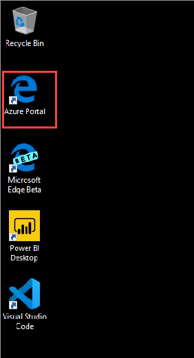

   - Connect with the **Azure Credentials** from **Environment Details** tab.
   
   

   - The portal opens with your credentials:  
      
   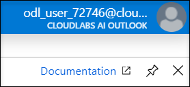
      
2. Select **All Services** from left hand pane, Search for **data explorer** and click the **star** icon.
 
   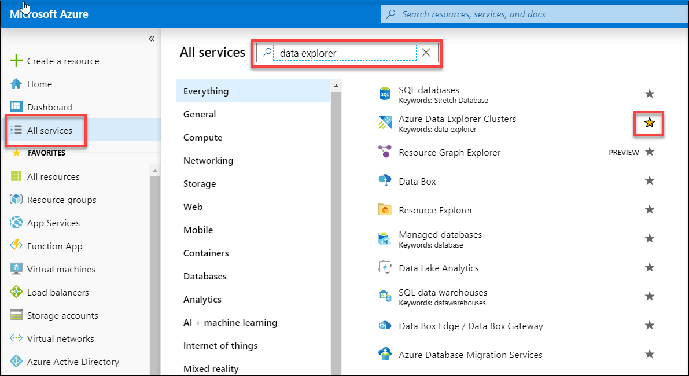
  
3. Drag **Azure Data Explorer Clusters** to the top of the **Favorite** menu.  
 
   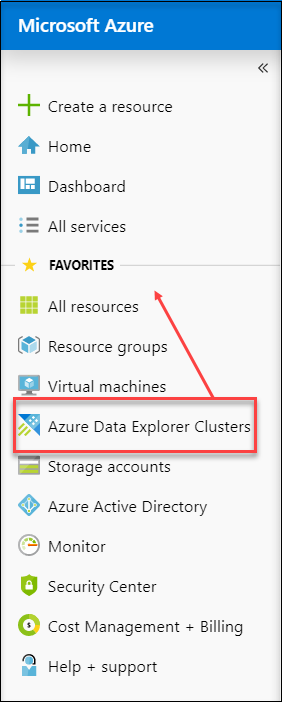
    
4. Select **Azure Database Explorer** from **Favorite** menu and select the pre-deployed **sharedadx cluster**.
   
   
    
5. Select **Databases** from the left-hand menu, under **Data** , and then select **TaxiRides** . 
   
     
 
6. In **Databases**, select your **TaxiRides** and Select **Query**
 
   
    
7. In the Web UI, select **Open on Web UI**
   
   
    
## Pre-Exploration 
### Kusto Query Language (KQL) 
-  | **count**

     >Counts records in input table (e.g. T)  
  
-  | **take** 10	
              
     >Get few records to become familiar with the data. No order ensured.  

-  | **where** Timestamp > ago(1) and UserId = ‘abdcdef’	
 	
     >Filters on specific fields  
  
-  | **project** Col1, Col2, …	
 	
     >Select some columns (use if input table has many columns)  
  
-  | **extend** NewCol1=Col1+Col2		
	  
     >Introduces new calculated columns  
 
-  | **render** timechart		
	
     >Plots the data (in KE and KWE) while exploring  
 
-  | **summarize** count(), dcount(Id) by Col1, Col2		
	 
      >Analytics: aggregations  
 
-  | **top** 10 by count_ desc 
	
     >Finds the needle in the haystack  
 
-  | **join** (…) on Key1, Key2 
	 
     >Joins data sets 
 
-  | **mvexpand** Col1,Col2 … 
	
      >Turns dynamic arrays to rows (multi-value expansion)  
 
-  | **parse** Col1 with <pattern>…
	
      >Deals with unstructured data  
	
 ### Questions 
 
   1.How many rows Trips table contain?
 
 
 ``` 
Trips
| count
 ``` 
   2.Take a 10 row sample of Trips
 
// Sample Trips lines 
 ``` 
Trips
| take 10
``` 
  3.Query trips distribution for 60 days by pickup datetime, start on 2017-12-01.

// Trips distribution for 60 days, by Pickup time
 ``` 
Trips
| where pickup_datetime between (datetime(2017-12-01) .. 60d)
| summarize count() by bin(pickup_datetime, 1d)
| render timechart
 ```
 4.Query the min and max pickup datetime 
  
 // The newest and the oldest trip by pickup datetime 
 ```
Trips
| summarize min(pickup_datetime), max(pickup_datetime)
 ```
 5.Query passenger 50, 90 and 99 percentiles 

 // The passenger count per percentiles  
 ```
Trips
| summarize percentiles(passenger_count, 50, 90, 99)
  ```

## Stream Analytics

### &nbsp;&nbsp;&nbsp;Create the Job

  1. In the Azure portal, click **Create a resource > Internet of Things > Stream Analytics job**.

  2. Name the job **asa_nyctaxi**, specify a subscription, resource group, and location.

>**Note**: It's a good idea to place the job and the event hub in the same region for best performance and so that you don't pay to transfer data between regions.

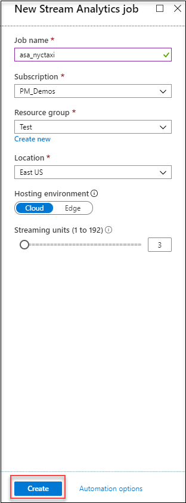

  3. Click **Create**.

### Configure job input
1. In the dashboard or the **All resources** pane, find and select the **asa_nyctaxi** Stream Analytics job.

2. In the **Overview** section of the Stream Analytics job pane, click the **Input** box.

   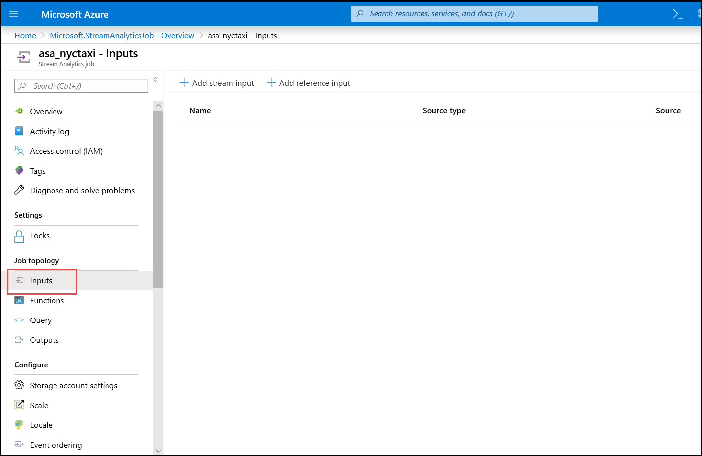

3. Click **Add stream input** and select **Event Hub**. Then fill the New input page with the following information.
   
   | **Settings**                   | **Suggested Value**          | **Description**|                                                         
   |------------------------------- |------------------------------|---------------------------------------------| 
   | **Input alias**                | **TaxiRide**                 | Enter a name to identify the job’s input.|   
   | **Subscription**               | **Your subscription**        | Select the Azure subscription that has the Event Hub you have created| 
   | **Event Hub namespace**        | **predefined EH namespace**  | Enter the name of the Event Hub namespace.|
   | **Event Hub name**             | **predefined EH for ASA**    | Select the name of your Event Hub.|
   | **Event Hub policy name**      | **predefined policy**        | Select the access policy that you created earlier.|
 
   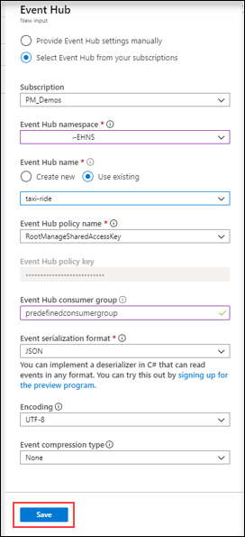
 
 4. Click **Save**.
 
 ### Create queries to transform real-time data
 
At this point, you have a Stream Analytics job set up to read an incoming data stream. The next step is to create a query that analyzes the data in real time. Stream Analytics supports a simple, declarative query model that describes transformations for real-time processing. The queries use a SQL-like language that has some extensions specific to Stream Analytics.
 
 You will use the query below as part of this exercise. This query calculates the average passenger count and average trip duration. In a later section, you'll configure an output sink and a query that writes the transformed data to that sink.
 
 Select “*Query*” under Job Topology and paste the following in the query text box.
 
```
 --SELECT all relevant fields from TaxiRide Streaming input
 WITH 
TripData AS (
    SELECT TRY_CAST(pickupLat AS float) as pickupLat,
    TRY_CAST(pickupLon AS float) as pickupLon,
    passengerCount, TripTimeinSeconds, 
    pickupTime, VendorID
    FROM TaxiRide timestamp by pickupTime
    WHERE pickupLat > -90 AND pickupLat < 90 AND pickupLon > -180 AND pickupLon < 180
)

SELECT avg(passengerCount) as AvgPassenger, avg(TripTimeinSeconds) as TripTimeinSeconds, system.timestamp as timestamps
INTO pbioutput
FROM TripData Group By VendorId,tumblingwindow(minute,1)

```
 
 Once you have saved this query, you can test it against sample input data. You can obtain sample input data by selecting ‘Reset’. This looks for input data from event hub and shows it in the bottom pane.

  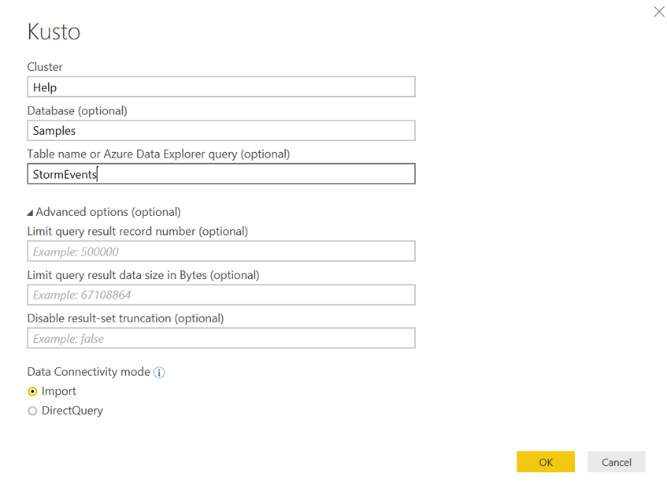

Once you can see data under “Input preview”, you can select **Test query**. The output will be displayed in “Test results”. When you have the query producing the expected results for test data, you can configure an output. When your job runs in the cloud, this is the destination which it will write the results to in real-time.

For this example, we will add a PowerBI output to your job and create a real-time dashboard that visualizes average passenger count over time.

 1. On the left menu, select Outputs under Job topology. Then, select + Add and choose Power BI from the dropdown menu.
 2. Select + Add > Power BI. Then fill the form with the following details and select **Authorize**.


    | **Setting**         | **Suggested Value**|
    |---------------------|-------------------|
    | Output alias        | pbioutput         |
    | Dataset name &nbsp;&nbsp;&nbsp;&nbsp;&nbsp;&nbsp;|nyctaxi| 
    | Table name          | nyctaxi-table     | 
 
    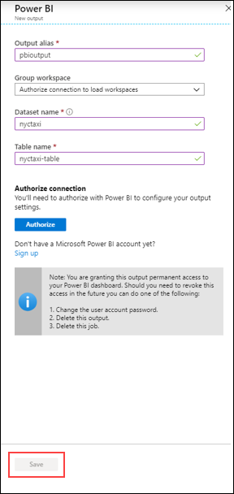
	
3. When you select **Authorize**, a pop-up window opens and you are asked to provide credentials to authenticate to your Power BI account. Once the authorization is successful, **Save** the settings.

4. Click Create.
	
### Run the job
Navigate to the **Overview** page for your Stream Analytics job and select **Start**. It will take a minute or two for the job to start running in the cloud. Once it is running, it is continuously reading and processing input events flowing in from your event hub. In our case, it is continuously calculating the average passenger count and writing it to a streaming dataset in Power BI.

#### Create the dashboard in Power BI
1. Go to [Powerbi.com](https://powerbi.com/) and sign in with your work or school account. If the Stream Analytics job query outputs results, you see that your dataset is already created (under “Datasets” you should be able to see ‘***nyctaxi***’)

2. In your workspace, click **+ Create**.

    
	
3. Create a new dashboard and name it **NYC Taxi**.

    
	
4. At the top of the window, click **Add tile**, select **CUSTOM STREAMING DATA**, and then click **Next**.

    
	
5. Under **YOUR DATSETS**, select your dataset and then click **Next**.	

    	
	  
6. Under **Visualization Type**, select **Card**, and then in the **Fields** list, select **AvgPassenger**.

7. Click **Next**.

8. Fill in tile details like a title and subtitle and click **Apply**. Now you have a visualization for average no. of passengers in a trip.You can try playing around by creating a line chart which plots average passenger count over a period of time (x axis: timestamps and y axis: AvgPassenger).

## Post-Exploration
1. Select Azure Database Explorer from Favorite menu and select the pre-deployed nycXXX cluster
    
    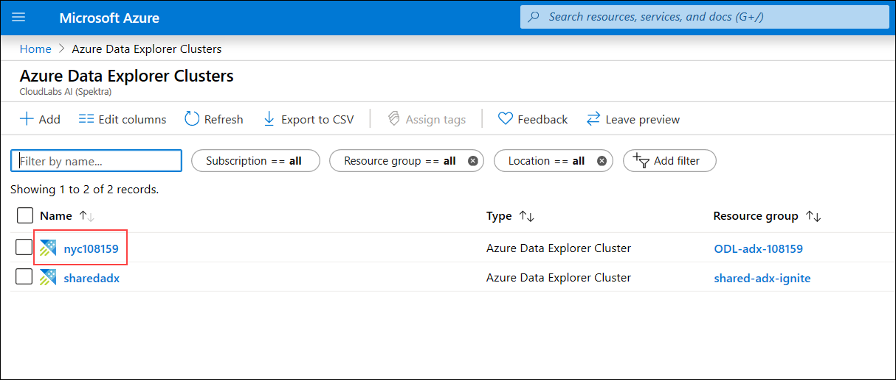 
	  
2. Select Databases from the left-hand menu, under Data , and then select TaxiRides
          
    
	   
3. In Databases, select TaxiRides and Select Query
         
    
	 
4. In the Web UI, select Open on Web UI  
        
    
	
### Questions
  1. What was the fare amount of the last trip which pass the 90 percentiles? 
 ```  
Trips
| where passenger_count > 4
| top 1 by pickup_datetime
| project fare_amount, vendor_id, passenger_count

 ``` 
  2. What was the fare amount for the trip with the max passenger count? 
 ```  
Trips 
| where passenger_count > 4  
| top 1 by passenger_count  
| project fare_amount, vendor_id, passenger_count 

 ```  
 
  3. How many trips this vendor has?  
 ``` 
Trips
| summarize count() by vendor_id
 ```
----
 
 ```
Trips
| where vendor_id == 2
| count
 ``` 

## Self-Study  
  
### Kusto Query Language (KQL)  

Free online Course – Basics of KQL - <http://aka.ms/KQLPluralsight>

## Power BI  
Power BI is used to visualize the data. Note that Power BI is a visualization tool with data size limitations. Default: 500,000 records and 700MB data size. 
 
## Connect to Help cluster  
1. Connect with the **Azure Credentials** from **Environment Details** tab.

    

2. Open Power BI desktop, select **Get Data**, and **More…** Type **Data Explorer** in the search box.

    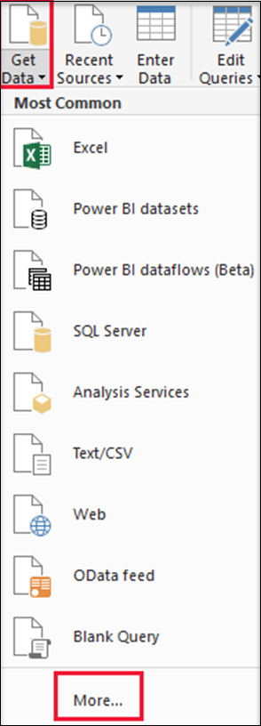  

3. Select **Azure Data Explorer (Kusto)** and **Connect** 

    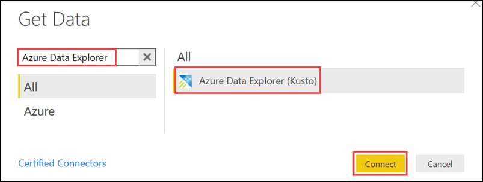  

4. Enter the following properties (leave all other fields empty) and then select **OK**  
   Cluster: **Help**  
   Database: **Samples**  
   Table name or Azure Data Explorer query: **StormEvents**  
   Data Connectivity mode: **Import**  
 
    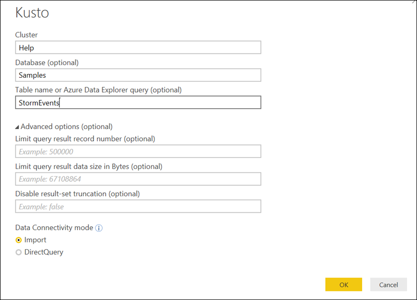 
 
5. Expand the Samples database and select StormEvents. If the table looks ok, select **Load**. To make changes, select **Edit**. 
 
    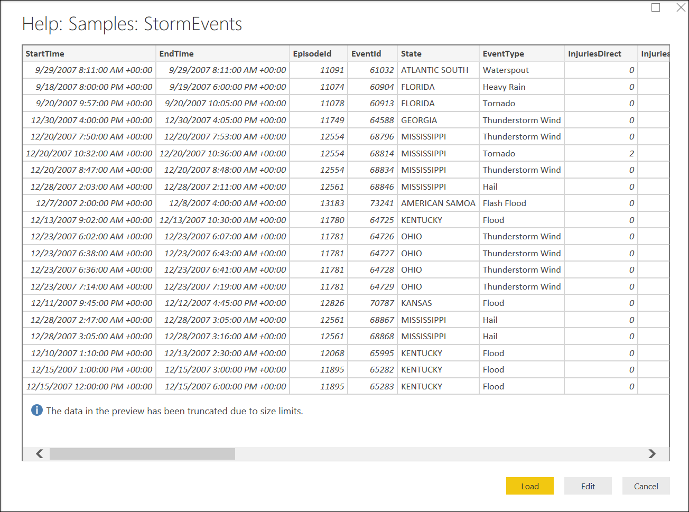  
 
6. The new StormEvents table was added to the Power BI report.  
 
      
 
 ### Create a Power BI report  
 
 1. Create a line chart with the total number of events, by putting “Start Time” in the Axis box (not in Date Hierarchy mode) and     **EventId** in the Values box.  
 
      
  
 2. Add a Map tile by putting **“BeginLat”** in the Latitude box and putting **“BeginLon”** in the Longitude box.  
 
      
 
 3. Create a Clustered column chart by putting **“Event Type”** in the Axis box and (count) **“Event Id”** in the value box.  
 
      
 
 4. Create 4 separate card tiles with **“DeathDirect”**, **“DeathIndirect”**, **“InjuriesDirect”** and **“InjuriesIndirect** in the Fields box.  
 
    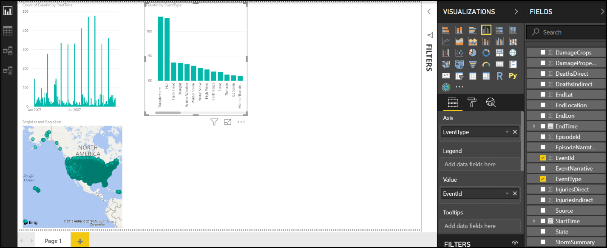  
 
 5. Create a pie chart of reporting sources by putting the **“Source”** in the legend box and putting the (count) **“EventId”** in the values box.  
 
    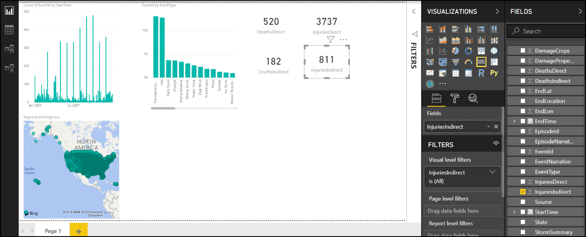  
 
 6. Now arrange the tiles on the canvas and you’re ready to slice and dice.  
 
      
 
 ### Power BI Connectors  
 1. Native Connector for Power BI
    - Native Connector **->** data explorer **->** Connect **->** Preview Feature (accept) continue.
    - Cluster: demo12.westus
    - Database: GitHub
    - Table: GithubEvent
    - Import **->** load data in advanced 
	- Seamless browsing experience   
	- Data size limitation  
    - **(Click) Direct Query ->load data per request** 
	- Load per request 
	- Longer response time 
   - Sign-in **->** connect 
   - Data sample **->** load 
   - Drag ID from the Fields on the right side of the screen 
   - Drag CreatedAt
   - Drag CreatedAt into ID square 
2. Blank Query for Power BI
   - Get Data **->** Blank Query 
   - Kusto Explorer **->** Tools **->** Query to Power BI (Query & PBI adaptor)
   - Connect - Organization account **->** use your account 
   - Click on **->** Advanced editor **->** Delete everything **->** Paste everything 
3. MS-TDS (SQL) client for Power BI
   - (ODBS Connector) End Point: Azure -> Azure SQL database 
     - Kusto Cluster as destination <https://docs.microsoft.com/en-us/azure/data-explorer/power-bi-sql-query>  

